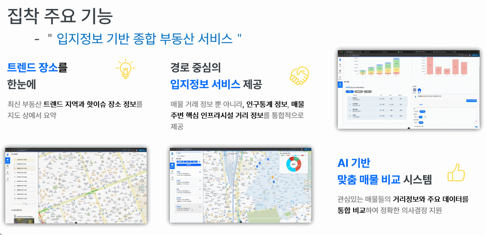
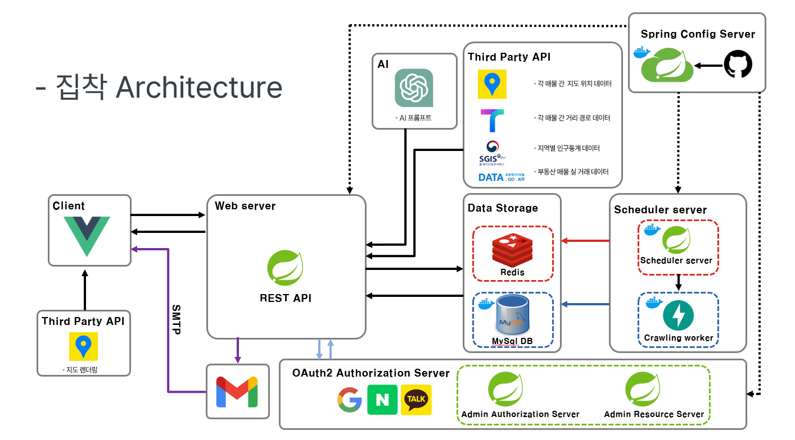
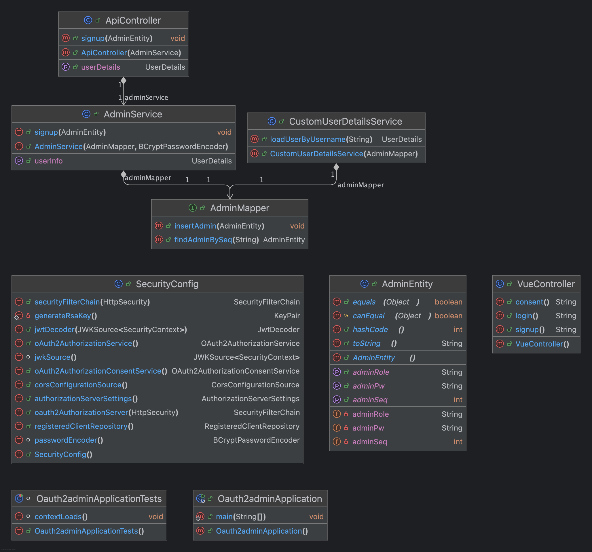
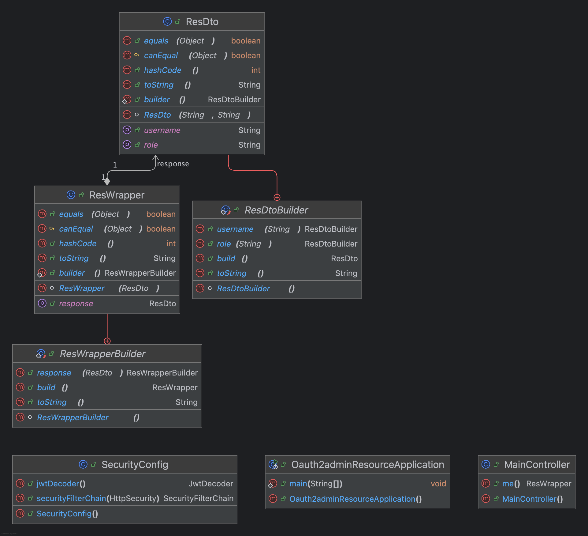
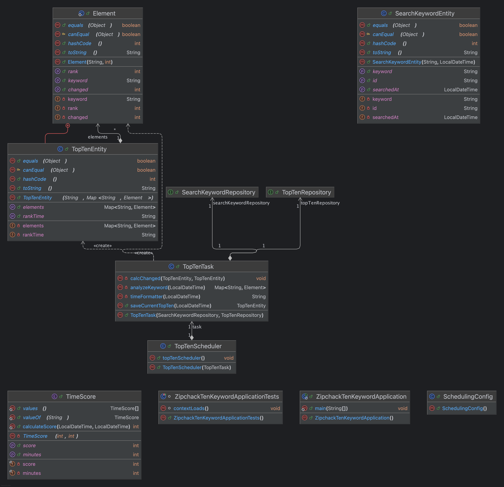
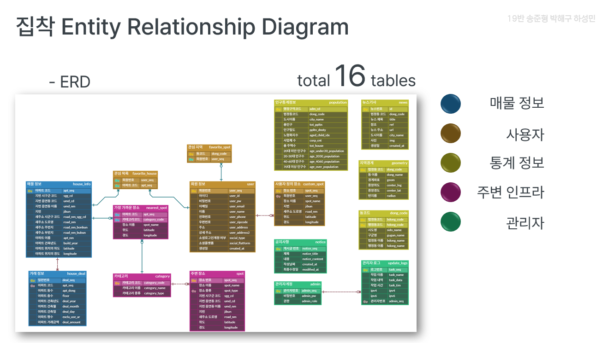

<!--

**Here are some ideas to get you started:**

🙋‍♀️ A short introduction - what is your organization all about?
🌈 Contribution guidelines - how can the community get involved?
👩‍💻 Useful resources - where can the community find your docs? Is there anything else the community should know?
🍿 Fun facts - what does your team eat for breakfast?
🧙 Remember, you can do mighty things with the power of [Markdown](https://docs.github.com/github/writing-on-github/getting-started-with-writing-and-formatting-on-github/basic-writing-and-formatting-syntax)
-->

# Zipchack

  
<strong>&nbsp;Table of Contents</strong>

&nbsp;  
[1. 팀 소개](#1-팀-소개-  ) 
[2. 프로젝트 소개](#2-프로젝트-소개- ) 
[3. 주요 기능](#3-주요-기능-) 
[4. 참고자료](#4-참고자료-) 

## 🏠 마음에 드는 집에 착! 집착 서비스 

안녕하세요, 맘에드는 집을 착! 보여드리는  
입지경로 기반 부동산 정보 제공 서비스 집착 입니다.
본 프로젝트는 SSAFY 12기 Java 관통 프로젝트 제출을 위해 개발되었습니다.

## 1. 팀 소개 👨‍👦‍👦 

SSAFY 12기 서울 19반  
개발 기간 : 2024.10.21 ~ 2024.11.15  
팀장 : 송준형
팀원 : 박해구, 송준형, 하성민

## 2. 프로젝트 소개 💒 

- 이사를 하고자 할 동네에서 원하는 아파트를 찾을 수 있습니다.
- 다양한 매매정보 및 지역정보를 확인할 수 있습니다. 
    - 특정 지역 매물 현황
    - 특정 매물 거래 현황
    - 특정 매물 거래 추이
    - 특정 매물과 지정 장소와의 경로 반환

- 정보에 따른 아파트의 모든 위치를 지도에서 마커로 동시에 확인할 수 있습니다.
- 관심지역, 관심매물, 사용자지정장소를 설정할 수 있습니다.
- 저장한 지정장소와 특정 매물과의 거리를 확인할 수 있습니다.

## 3. 주요 기능 💻

### - 상세 페이지 흐름 
1. 홈 페이지
    - 회원가입
    - 로그인

2. 메인 페이지 
    - 핫이슈 지역 확인
    - 매물 검색
        - 매물 상세
        - 지역 상세
        - 경로 상세
    - 즐겨찾기
        - 지역 등록
        - 매물 등록
        - 사용자장소 등록
    - 대시보드
        - 지역 비교
        - 매물 거리 비교
        - AI 분석 
            - 전망 분석
            - 매물 추천

## 4. 참고자료 ⭐

1. 아키텍쳐
**스프링 컨피그 서버**를 통해서 설정파일을 관리하고
워커에 **스케줄링 서버**로 인기검색어를 연산하거나 데이터를 크롤링했습니다.  

관리자의 경우 **인증 서버**를 통해 인증 인가를 받을 수 있도록 OAuth2 의 표준을 준수했습니다.

2. 클래스 다이어그램
- 클래스 다이어그램의 경우 네 개의 서버 별 이미지를 분리했습니다.

    -1. 사용자 페이지 서버

    -2.  관리자 페이지 인증 서버

    -3. 관리자 페이지 자료저장 서버

    -4. 스케쥴러 서버

- news 데이터를 가져오는 파이썬 서버는 생략했습니다.

3. 데이터베이스 구조
프로젝트는 다음과 같은 주요 테이블로 구성되어 있습니다:

4. DB schema - [링크](zipchack-ssafyhome-schema.sql)

5. 시연 영상 - [시연영상 링크](https://youtu.be/boLV34j1OJk)

